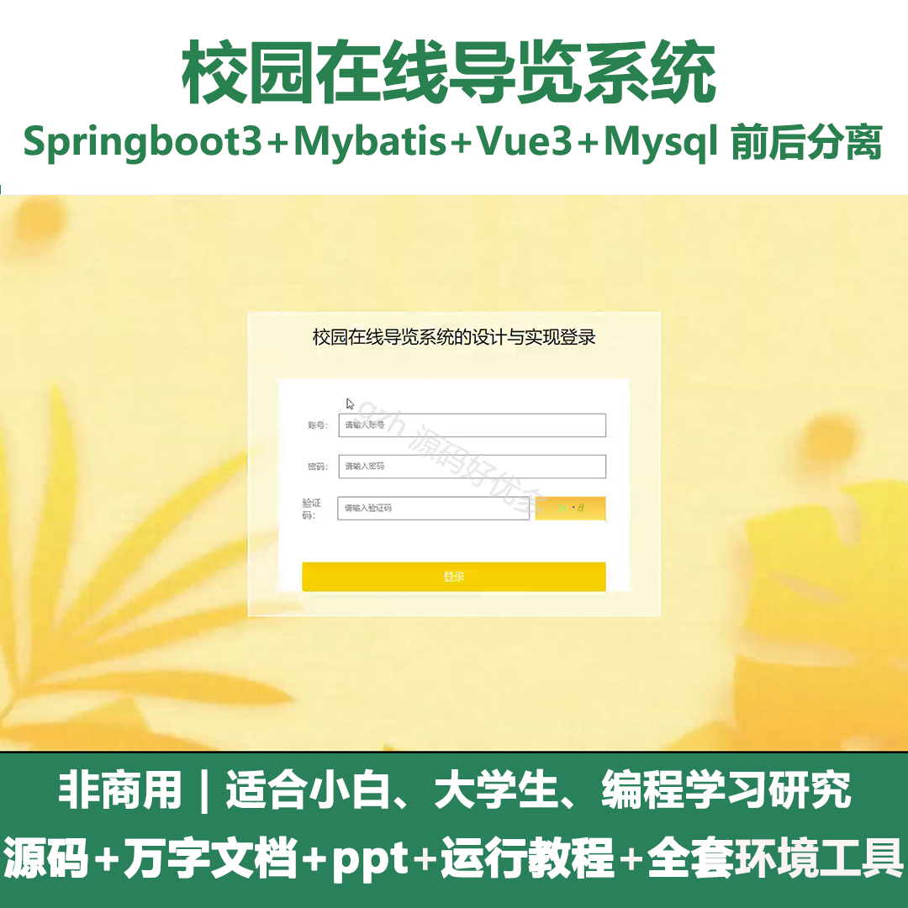
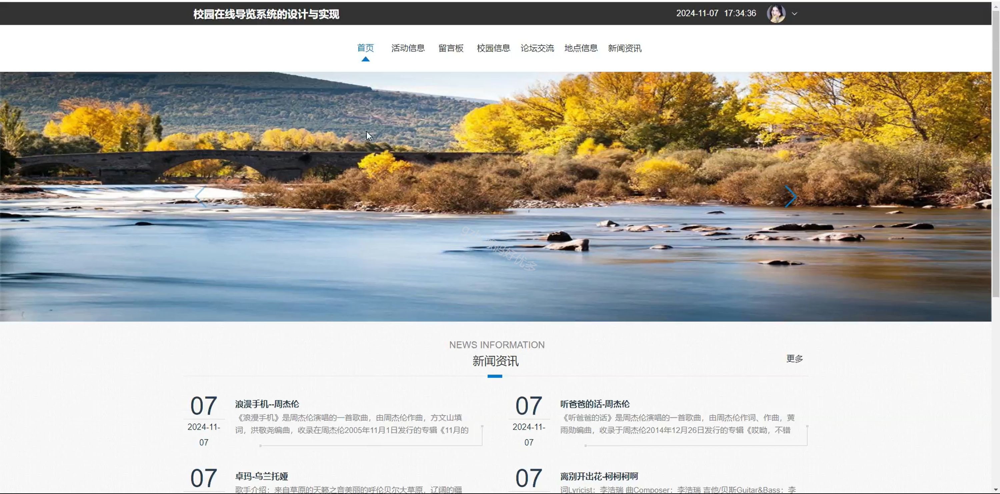
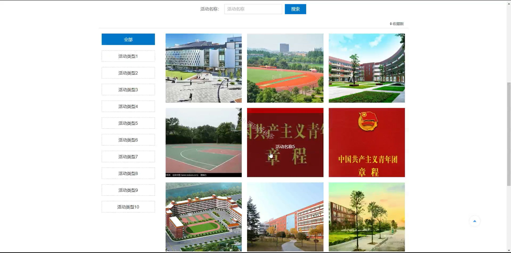
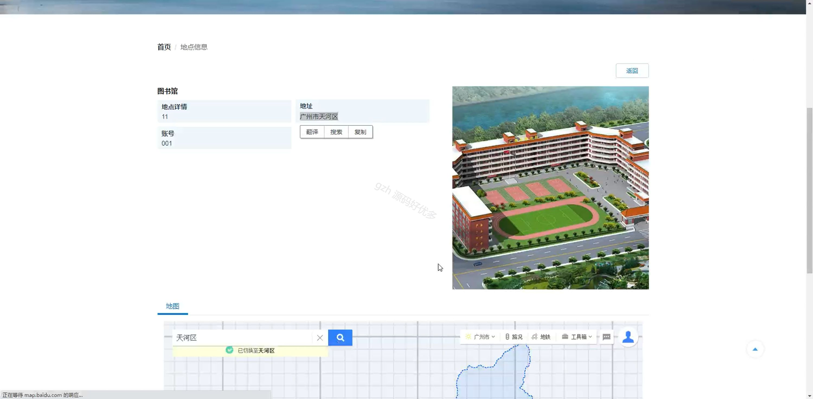
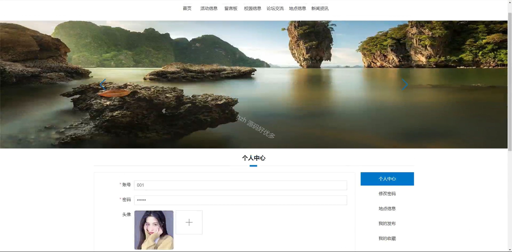
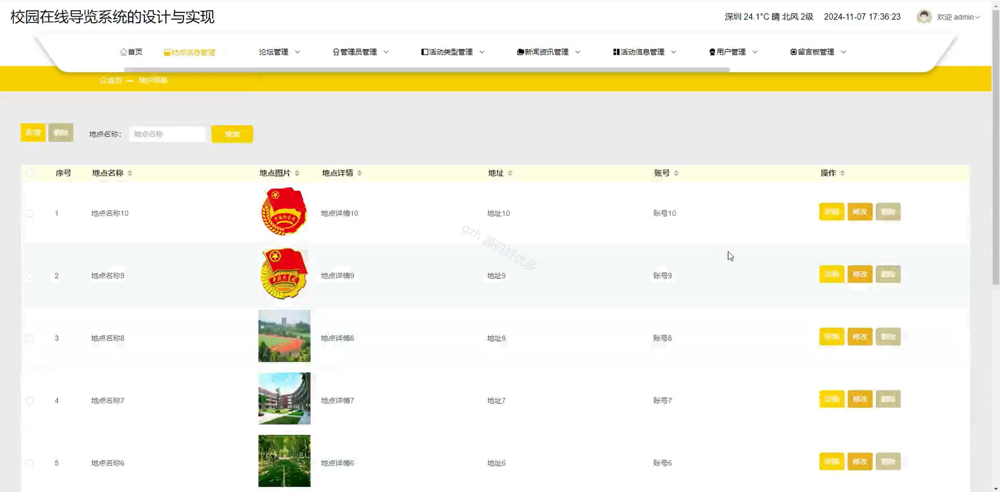
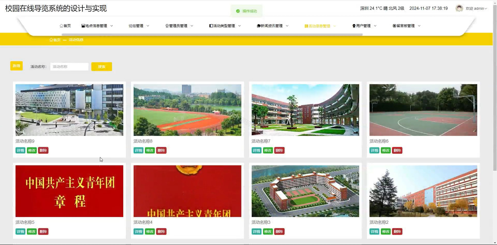
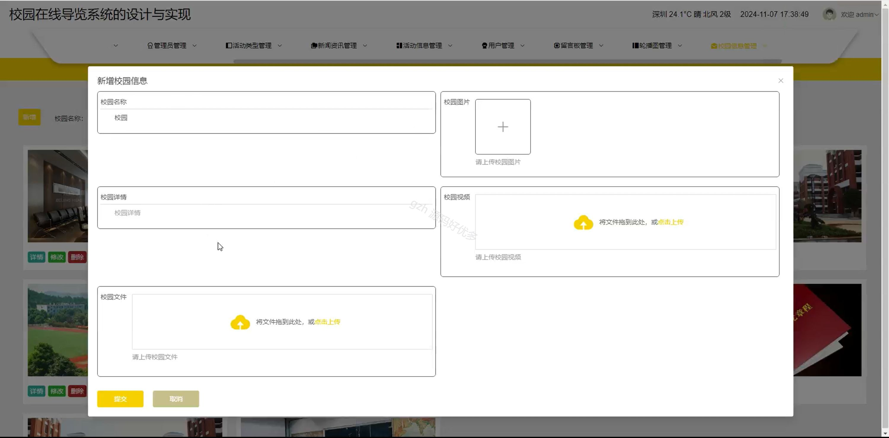
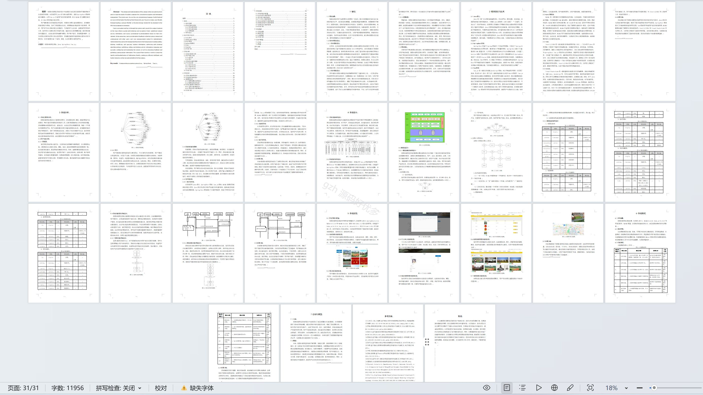

# springbootA148D
springbootA148D校园在线导览系统+LW+PPT
 
## 查看主页获取源码

### 一、关键词
校园信息管理、校园地点信息、校园活动信息

### 二、作品包含
源码+数据库+设计文档万字+ppt+全套环境和工具资源+部署教程

### 三、项目技术
前端技术：Html、Css、Js、Vue3.0、Element-ui 
后端技术：Java、SpringBoot3.0、MyBatis

### 四、运行环境（以下版本亲测，其他版本未知，请自测）
开发工具：IDEA/eclipse  + VSCODE

数据库：MySQL5.7（最低要5.7版本）

数据库管理工具：Navicat10以上版本

环境配置软件： JDK17 + Maven3.6.3

前端Nodejs：20

浏览器：谷歌浏览器

### 五、项目介绍
项目编号：springbootA148D

校园在线导览系统能让用户在线便捷查询校园地点等信息，实现校园场景导览及相关内容管理 ，帮助师生、访客快速熟悉校园，提升校园信息获取与交互效率。

角色：管理员、用户

管理员：首页、地点信息管理、论坛管理、管理员管理、活动类型管理、新闻资讯管理、活动信息管理、用户管理、留言板管理、轮播图管理、校园信息管理。

用户：首页、活动信息、留言板、校园信息、论坛交流、地点信息、新闻资讯、个人中心、修改密码、地点信息、我的发布、我的收藏。

### 六、运行截图

